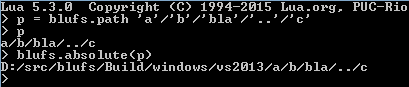

blufs
=====

a lua wrapper of the [Boost Filesystem](http://www.boost.org/doc/libs/1_57_0/libs/filesystem/doc/reference.html) library, meant as a cross-platform replacement for [luafilesystem](http://keplerproject.github.io/luafilesystem/).

Status: semi-abandoned, searching for a paradigm

specification
=============

Original Boost Filesystem API: [@boost.org](http://www.boost.org/doc/libs/1_57_0/libs/filesystem/doc/reference.html)

see [test.cpp](./test.cpp)

lufs
====

a customized lua executable, which includes *blufs*.

embedded libraries
------------------

- [lualinq](https://github.com/xanathar/lualinq.git), Copyright (c) 2014, Marco Mastropaolo
- *blufs*
 

dependencies
============

- [Lua](http://www.lua.org/)
- [Boost Filesystem](http://www.boost.org/doc/libs/1_47_0/libs/filesystem/v3/doc/reference.html)
- [LuaBind](http://www.rasterbar.com/products/luabind/docs.html)

testing using:
- [Catch](https://github.com/philsquared/Catch)
- [LuaState](https://github.com/AdUki/LuaState)

license
=======

Copyright 2013-2015 Dmitry Ledentsov

[MIT License](http://opensource.org/licenses/MIT)
